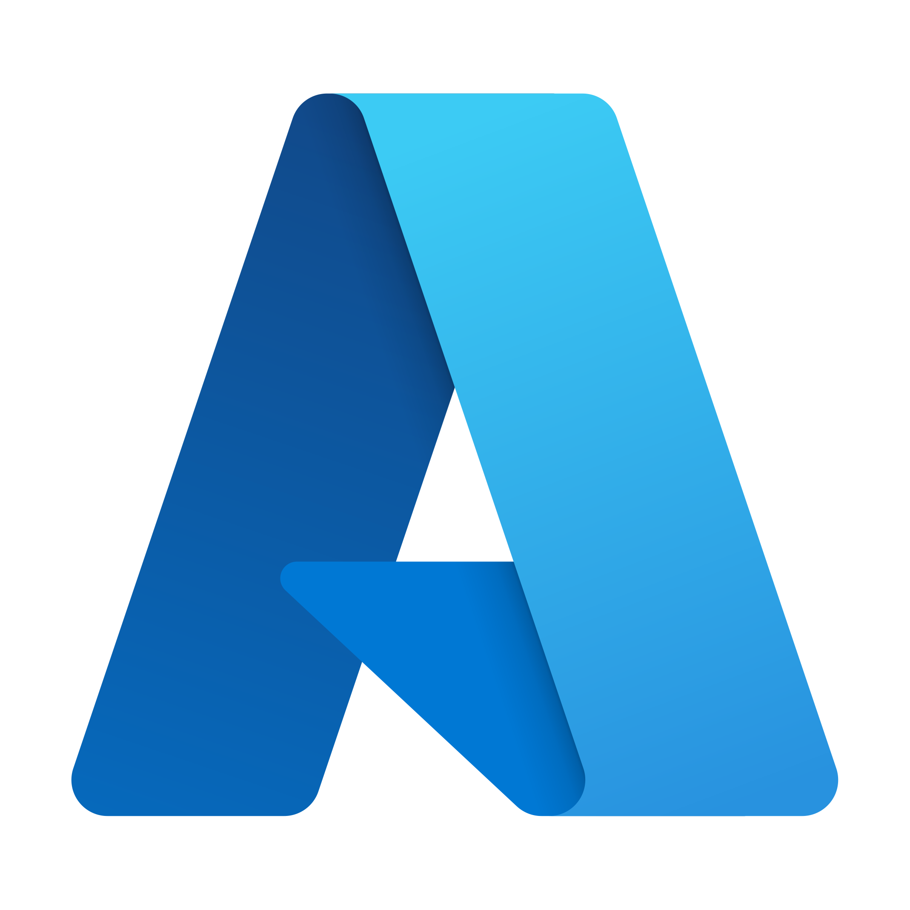
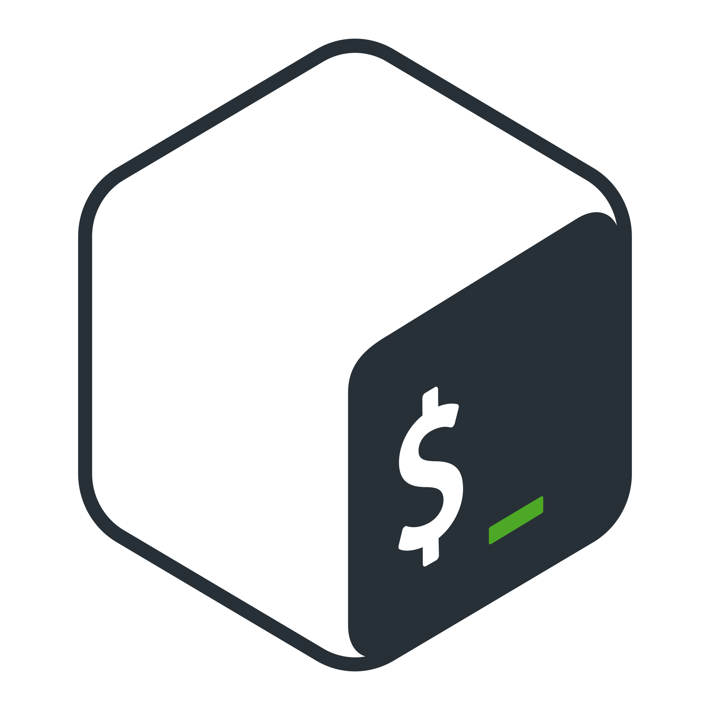
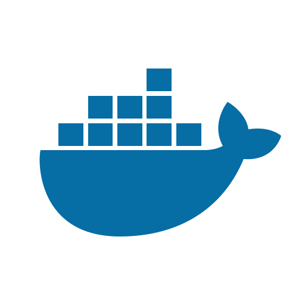
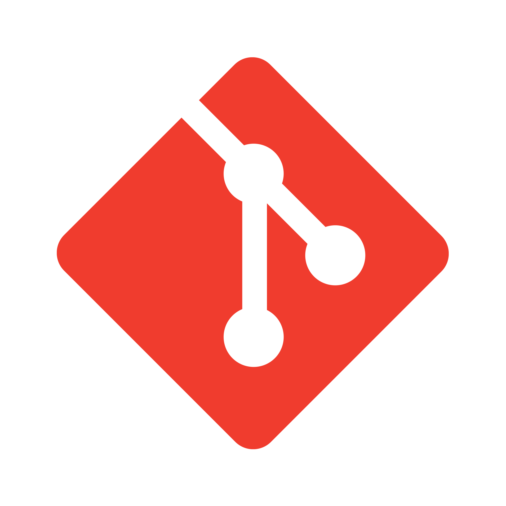
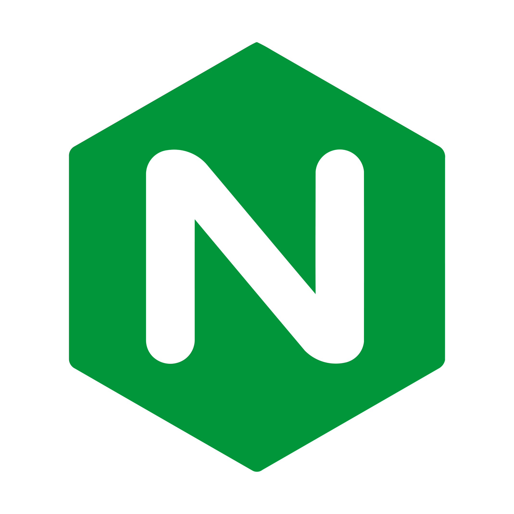

<h1 align="center"> Hi, I'm Abel Chiriguayo!</h1>
<h3 align="center">A passionate DevOps Engineer from Ecuador Living in Canada</h3>

- 🏢 I'm currently working as a **Technical Support** in **SoFi**!
  
- 🌱 I'm currently preparing an **AWS certification**
  
- ⭐ I enjoy working on AWS projects that combine **automation** and **high availability**

- 🌱 I'm currently learning **GO** and **AWS**
  
- 💬 You can ask me questions about **Ansible**, **Terraform** and **Linux**

## Languages and Tools:
  
 
    
    
    
     
     
    
     </a> 
    
    
    

&nbsp;

<!--
**gachirig/gachirig** is a ✨ _special_ ✨ repository because its `README.md` (this file) appears on your GitHub profile.

Here are some ideas to get you started:

- 🔭 I’m currently working on ...
- 🌱 I’m currently learning ...
- 👯 I’m looking to collaborate on ...
- 🤔 I’m looking for help with ...
- 💬 Ask me about ...
- 📫 How to reach me: ...
- 😄 Pronouns: ...
- ⚡ Fun fact: ...
-->
